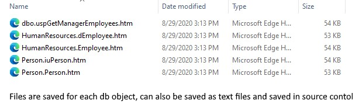
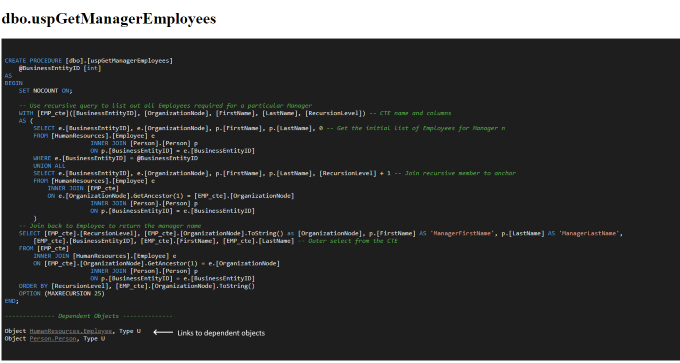
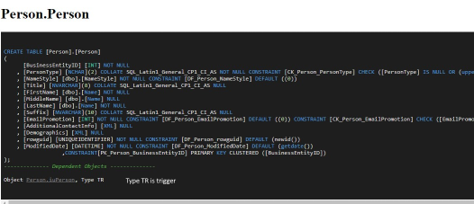

# Introduction
As a consultant I am put in the position getting up and running fast. 
One of the challenges I repeatedly come across is understanding business logic in the database.

A consistent pattern I find is building subsystems to do work (think calculate commissions or do a daily balance) 
utilizing stored procedures which in turn are built on more stored procedures.

Using Microsoft SQL Server management studio you can typically manage viewing the objects (Stored Procedures, Views, Tables, Triggers and dependencies) 
by right mouse clicking on an object and bringing up a context menu allowing actions on the object.
Typically each action is either placed in a new window or a clipboard to copy elsewhere.

Another option is to use built in system stored procedures to do many of the same things. I typically have a set of scripts that I can use to help me be more efficient, I can run multiple statements in a window or copy replace depending on the situation.


# Background
My absolute go to system stored procedure is sp_helptext, using this we can generate the internal code stored which describes the following types:

- Stored Procedures
- Views
- Triggers
- Functions

sp_helptext will not return the schema for user or system tables. Typically this would be used in this fashion
```
  > sp_helptext uspprinterror
```
Which would generate a single column (text) table with rows for each row in the definition.
```
   -- uspPrintError prints error information about the error that caused   
   -- execution to jump to the CATCH block of a TRY...CATCH construct.   
   -- Should be executed from within the scope of a CATCH block otherwise   
   -- it will return without printing any error information.  
   CREATE PROCEDURE [dbo].[uspPrintError]   
   AS  
   BEGIN  
       SET NOCOUNT ON;  
     
       -- Print error information.   
       PRINT 'Error ' + CONVERT(varchar(50), ERROR_NUMBER()) +  
             ', Severity ' + CONVERT(varchar(5), ERROR_SEVERITY()) +  
             ', State ' + CONVERT(varchar(5), ERROR_STATE()) +   
             ', Procedure ' + ISNULL(ERROR_PROCEDURE(), '-') +   
             ', Line ' + CONVERT(varchar(5), ERROR_LINE());  
       PRINT ERROR_MESSAGE();  
   END;  
```
When I want to see the table schema, I use dynamic SQL which I found at 
https://www.c-sharpcorner.com/UploadFile/67b45a/how-to-generate-a-create-table-script-for-an-existing-table/

This will return the table definition in a similar fashion  

Finally you might want to determine dependent objects of a stored procedure so that you could more easily identify items if interest. 
This is also dynamically created using a union of the sys.object where {0} is the object name and {1} is the schema name.
```
     	  select sch_do.name + '.' + do.name as Name, do.type as Type,1
           from sys.objects as o
           join sys.objects as do on do.object_id = o.object_id
           join sys.schemas as sch_o on sch_o.schema_id = o.schema_id
           join sys.schemas as sch_do on sch_do.schema_id = do.schema_id
         where
           o.name = '{0}' and sch_o.name = '{1}' 
           and do.name = '{0}' and sch_o.name = '{1}'
         union
         select sch_do.name + '.' + do.name as Name, do.type as Type,2
         from sys.objects as o
           join sys.sql_expression_dependencies as d on d.referencing_id = o.object_id
           join sys.objects as do on do.name = d.referenced_entity_name
           join sys.schemas as sch_o on sch_o.schema_id = o.schema_id
           join sys.schemas as sch_do on sch_do.schema_id = do.schema_id
         where
           (o.name = '{0}' and sch_o.name = '{1}') and(do.name != '{0}' or sch_o.name != '{1}')
         union
         select sch_do.name + '.' + do.name as Name, do.type as Type,3
         from sys.objects as o
           join sys.triggers as d on d.parent_id = o.object_id
           join sys.objects as do on do.object_id = d.object_id
           join sys.schemas as sch_o on sch_o.schema_id = o.schema_id
           join sys.schemas as sch_do on sch_do.schema_id = do.schema_id
         where
           (o.name = '{0}' and sch_o.name = '{1}') and(do.name != '{0}' or sch_o.name != '{1}') order by 3", tableName, schemaName);
 ```

In the above code, sys.sql_expression_dependencies is used to also find unbound schema entities. This is useful if you create a stored procedure which calls a procedure which hasn't been created yet.


# Tying it together
After finding myself using the preceding techniques over and over, I decided to encapsulate these into a small program which I use to help me.

The program included uses these to generate a single file per object in either text or HTML format which I have included source code. Each file has an extra section added to the bottom which is that objects dependencies. In HTML mode they are hyper linked to each other. 


In addition, the program illustrates other techniques including recursion, and using a T4 template to embed and create a dynamic HTML file. 


# A quick note on T4
Typically T4 templates are used at design time rather than at runtime. When picking the T4 templates there will be one for a Text Template and one for the Runtime Text Template.
The differences in the TT files are minor, Text Template adding a default output extension and a debugging directive. Additionally the Text Template will have it's Custom Tool property set to 'TextTemplatingFileGenerator'
The Runtime Text Template will have a value of 'TextTemplatingFilePreprocessor'

Finally, the runtime generation is accomplished with the following code
```
   Helpers.CurrProcText = DBText.ToString();

   PageHTM template = new PageHTM();   
   string pageContent = template.TransformText();

  > File.WriteAllText(string.Format("{0}.htm", spName), pageContent);
```
In my case, I simply replaced the default TT file with a html template and renamed with the extension .tt
In the template I use the following to replace at runtime.
```
   <#= Helpers.CurrProcText #>
```
Where Helpers is a static class holding the text to insert.


# When procedures can be grouped by functionality
Up until now, I have described how to inspect individual objects, the issue still exist that the process is not able to bring clarity to the connection between database objects.

In my experience many large companies which depend on stored procedures to drive their business will group functionality together, some procedures may be shared across domains (maybe a proc that sends emails).
They may have a series of procedures which runs on a schedule to update information about customer updates and maybe another grouping of inventory.

The enclosed application starts with a seed object (in this case, dbo.uspGetManagerEmployee in the adventureworks database) and will expand all related objects, creating individual files for each referenced object.



Each htm file contains a single object with dependency links open the other files. Using browser navigation you can easily traverse each file. The files are colorized using highlight.js https://highlightjs.org/ with the CSS set to visual studio 2015 dark mode. 






You can create a folder for each type of grouping and add the application to your PATH variable. Doing this allows you to group files under the folder. 

To make it easier you may also want to create a batch file to supply consistent parameters in each folder, allowing you to version files over time.
Example:
```
   start spdiscover.exe procedure=%1 server=(LocalDB)\MSSQLLocalDB; AttachDbFilename=c:\testdatabase\SPDiscoverDB.mdf; Integrated_Security=true; ShowConnectionString=true
```


# Using the program
In it's most basic form you would simply start the program with parameters. The program expects it's parameters to be key value pairs separated with an equal (=) sign. The order of the parameters does not matter. Special parameters are as defined:

- procedure
  > procedure=dbo.CalculateTax
- outputtype
  > outputtype=txt (optional, normally HTML)
- launchwindow
  > launchwindow=true (optional, will open new window on navigation)
- help
  > Will display internal keywords
- ShowConnectionString
  > for debugging purposes to see what connection string is being generated.
  
The program uses the SqlConnectionStringbuilder to create a valid string from parameters passed in. Each parameter is compared to the collection of keys which the builder is aware and generate a valid connection string. 

Keywords which contain a space will need to replace the space with an underscore. Ex. Data Source becomes Data_source.

For example if the following were passed in:

	Data_Source=localhost
	Initial_Catalog=AdventureWorks
	Integrated_Security=True

would generate - 
```
   Data Source=localhost;Initial Catalog=AdventureWorks;Integrated Security=True
```


